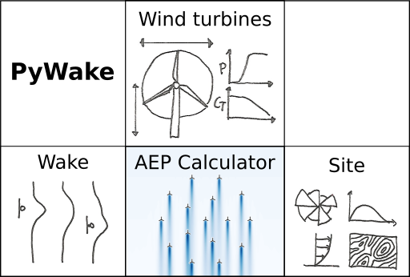

.. PyWake documentation master file, created by
   sphinx-quickstart on Mon Dec  3 13:24:21 2018.
   You can adapt this file completely to your liking, but it should at least
   contain the root `toctree` directive.

Welcome to PyWake
===========================================

*- an AEP calculator for wind farms implemented in Python including a collection of wake models*

**Quick Start**::

    pip install py_wake

Source code repository (and issue tracker):
    https://gitlab.windenergy.dtu.dk/TOPFARM/PyWake
    
License:
    MIT_

.. _MIT: https://gitlab.windenergy.dtu.dk/TOPFARM/PyWake/blob/master/LICENSE

Contents:
    .. toctree::
        :maxdepth: 2
    
        installation
        introduction
        reference_guide
        exercises
