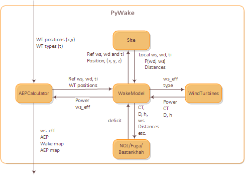

Overview
============

AEPCalculator
-------------

    The `AEPCalculator` calculates AEP by summarising the product of power, 
    probability and the number of hours pr year for wind turbines, 
    wind speeds and wind directions:

    .. math::
        AEP = \sum_{wt}\sum_{wd}\sum_{ws} P(wd,ws) \cdot Power(wt,wd,ws) \cdot 24 \cdot 365

WindTurbines
------------

    The `WindTurbines` provides the power, `Power`, and thrust coefficient, `CT` 
    for the specified wind turbines, `type`, effective wind speed, `ws_eff` as 
    well as the wind turbine hubheight(s),`h` and diameter(s), `D`.
    
        
WakeModel
---------

    The `WakeModel` iterates over all turbines in down-wind order. For the n'th 
    most upstream turbine, the effective wind speed is calculated by subtracting
    the wake deficit from upstream turbines from the local (no-wake) wind speed 
    (provided by `Site`). 
    Note, that the way the deficits are summed up is wake-model specific.
    
    The deficit from the current turbine can now be calculated at the position of
    all down stream turbines based on the down-stream, cross-wind and vertical 
    distance (calculated by `Site`), the thrust coefficient (calculated by 
    `WindTurbines`), etc. Note, that the deficit calculation is also wake-model 
    specific.
    
    
Site
----

    `Site` provides the local wind conditions in terms of wind speed, wind 
    direction and turbulence intensity for a given position (x,y,z) and 
    reference wind speed and direction. In addition it calculates the 
    probability, `P`, of this event. 
    
    Finally, it calculates the down-wind, cross-wind and vertical distance 
    between wind turbines which in non-flat terrain is different from the 
    straight-line distances.
    